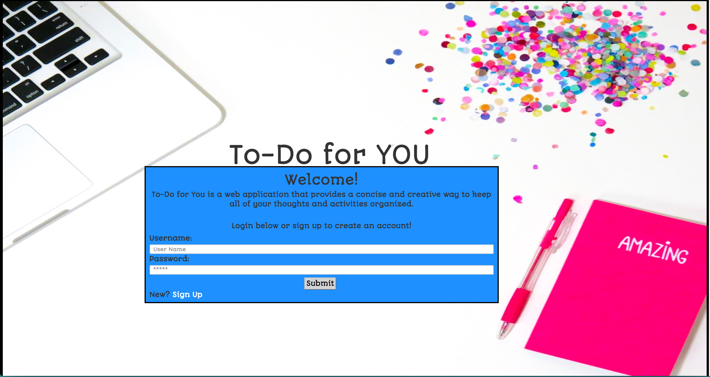

# To-Do for You

If you don't want to create an account you can use the demo account below. to play around.
Login: demo  
Password: demo

## What it is

To-Do for You is a web application that provides a concise and creative way to keep all of your thoughts and activities organized. Users can create an account or sign in.Users also have the ability to add,edit and delete tasks.

## Languages and Technologies

## What I used

* HTML
* CSS
* JavaScript
* jQuery 
* Node.js
* Express
* mySQL
* Amazon Web Services
* EJS(for templating)
* bcrypt-nodejs (node module, used to store encrypted passwords into the database)
* express-session (node module, used to keep the current user logged in and save information about that user)

##Site Walkthrough

###Landing Page

Users see a brief welcome message and can either log in or creare an account.
 

    </img>
 

###User's Home Page

Top left corner shows their name and the logout link. The user also sees the Task's box where they can add,edit,or delete tasks.

    </img>
 

### Edit Tasks Page

 Users can view their selected task/date and make changes. 

	</img>

##Challenges

###Challenge 1:

###Challenge 2:

