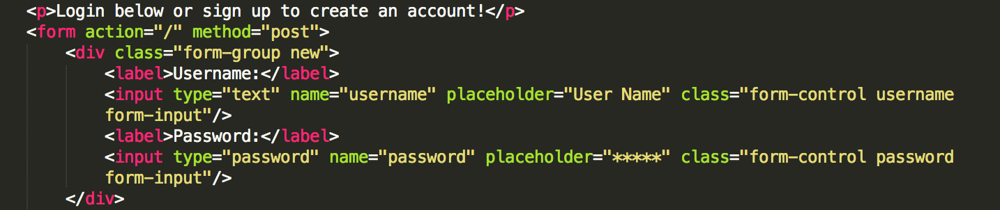

# To-Do for You

## What it is

To-Do for You is a web application that provides a concise and creative way to keep all of your thoughts and activities organized. Users can create an account or sign in. Users also have the ability to add,edit and delete tasks.

## Languages and Technologies

## What I used

* HTML
* CSS
* JavaScript
* jQuery 
* Node.js
* Express
* mySQL
* Amazon Web Services
* EJS(for templating)
* bcrypt-nodejs (node module, used to store encrypted passwords into the database)
* express-session (node module, used to keep the current user logged in and save information about that user)

## Site Walkthrough

## Landing Page

Users see a brief welcome message and can either log in or create an account.
 

    </img>
 

## User's Home Page

Top left corner shows their name and the logout link. The user also sees the task's box where they can add,edit,or delete tasks.

    </img>
 

## Edit Tasks Page

 Users can view their selected task/date and make changes. 

	</img>

## Challenges

## Challenge 1:
My first challenge occured while working with the bcrypt module to ensure password security as users logged in. Below you will see the code, where I explicitly organized an if else statement to ensure all potential sign in issues were covered.

	</img>

Below, you will also see a snippet of what the URL rendered. This was slightly frustrating because I knew this issue would be a massive security breach and not comply with my MVP(minimal viable product) requirements.

	</img>

## Solution 1:
If I am having a functionality issue, my thought process is to always comb through the .js(javascript) file first. If I am still having the same issue, after performing several unit test or console.logs, I move on to the structure pages(.html).I circled back to my .ejs file(templating page) and I compared my post route syntax to the other routes that were functioning properly and I found the error here.

	</img>

 

## Challenge 2:
I was having issues  editing tasks via my edit page and having them updated on my user's home page. My initial thought process was to pass in an updateQuery as that was the goal of the page(funtionality-wise). I wanted to update mySQL database with the newly edited information. 

	</img>

## Solution 2:
After running various tests on my updatequery, I decided to take a step back and simplify my thought process on what I wanted my code to do. I find writing in psuedo-code to be very helpful when I tend to over think how I can re-structure potential solutions. With that in mind, I decided to change my updatequery to an insertquery so my information could be added into my database and ultimately rendered on the user's home page.

	</img>

